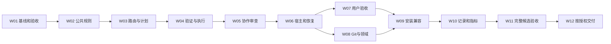

# Devflow V2.0 可执行实施计划

| 属性 | 内容 |
| --- | --- |
| 计划版本 / 日期 | 0.1 / 2026-09-07 |
| 状态 | **完整V2.0验收未完成（2026-09-13复核更正）**：T31—T33存在必需行为和原生宿主缺口。T34 PR#11及5/5 CI、T35合并`c28e765`、T36标签和T37安装切换是已发生的交付记录，不代替验收门槛；不再声称全部37项完成。 |
| 需求基线 | [Devflow V2.0 产品需求Spec](/H:/myAPP/Devflow/devflow/specs/changes/devflow-v2/specs/product-requirements.md)，文档0.1，40项FR、8项NF、40个AT |
| 当前仓库 | H:/myAPP/Devflow/devflow |
| 当前代码基线 | V1.3.1，提交137e025ba7e68f53a2cdb36608a5f46a67dd0364 |
| 本次授权 | 用户已要求以subagent执行；本地实施已授权，T34—T37仍遵循对应前置条件与动作授权 |
| 实施范围 | T01—T33完成V2.0本地候选及验证；T34—T37为具备对应授权后执行的交付动作 |
| 执行模式 | 按用户要求采用聚焦子代理；共享写入串行，先需求审查再质量审查 |

**目标：**把现有技能包升级为阶段明确、授权可复用、验证有依据、交付可验收、安装可核验的V2.0，保留33个旧技能入口。

**实施形态：**继续采用Markdown技能包；把公共规则放入可随技能安装的参考文件，领域技能按需引用。维护检查、离线记录与验收材料处理优先使用Python标准库，沿用现有Bash检查入口；不新增Agent运行时、云服务或Node依赖。

**执行交接：**后续明确要求实施时，使用executing-plans或会话内TDD与incremental-implementation逐项推进。任务频繁修改共享router、合同和检查工具，不适合默认多代理同时写入。这里选择执行方式不表示现在开始实施，也不要求用户为每个已批准的可逆子步骤重新确认。

## 1. 阅读方法与完成口径

先读第2节的实现决策及第3节的顺序，再按第5节任务卡执行。每张任务卡给出依赖、文件、具体步骤、验证与完成条件。任务号是执行单位；工作包是每2—3项任务后的集成检查点，最后一个交付工作包含4项独立授权动作。

任务状态使用“未开始、进行中、待依赖、待特定授权、完成”。只有产物、适用验证和任务验收都齐全，才勾选任务。工作包检查点是内部验证与审查，不默认增加人审停顿，也不自动创建PR。

规则变更采用行为证明：先在固定输入中观察基线表现，记录预期与实际，再修改规则、重放同一场景。基线已符合要求时保留正向回归，不故意制造失败。脚本的行为改动采用有意义的失败测试再实现；不为Markdown文字存在与否写镜像测试。

S表示约1—2个主要文件，M表示约3—5个主要文件；验收证据写到独立本地目录，不计入产品文件规模。不承诺固定小时数。某任务超过一次聚焦工作时，按其已列出的功能边界继续拆分，保留任务号下的子项，不扩大需求范围。

## 2. 已核实的仓库事实与实现决策

### 2.1 当前事实

- [router](/H:/myAPP/Devflow/devflow/skills/devflow/SKILL.md)、[共享入口](/H:/myAPP/Devflow/devflow/skills/using-devflow/SKILL.md)和其余技能均为Markdown；33个入口平铺在skills下。
- 当前校验入口是[scripts/check-refs.sh](/H:/myAPP/Devflow/devflow/scripts/check-refs.sh)，检查元数据、引用、旧命名和310行入口预算；脚本内部已经调用Python。
- 当前CI是[.github/workflows/validate.yml](/H:/myAPP/Devflow/devflow/.github/workflows/validate.yml)，包含引用检查和PR版本变更检查；没有业务构建命令或包管理锁文件。
- [.claude-plugin/plugin.json](/H:/myAPP/Devflow/devflow/.claude-plugin/plugin.json)记录1.3.1；版本改动需要同步CHANGELOG和双语说明。
- 现有[项目覆盖模板](/H:/myAPP/Devflow/devflow/templates/project-overrides.md)位于技能目录外。使用审计指出扁平安装会缺失该引用，计划需同时解决资源归属和安装检查。
- Spec为上一阶段新增的本地文档；当前规划不改变其需求或评审状态，不复扫69GB历史记录。

### 2.2 本计划采用的具体方案

| 决策 | 实施选择 | 原因与约束 |
| --- | --- | --- |
| 公共合同位置 | H:/myAPP/Devflow/devflow/skills/using-devflow/references/下的phase-contract.md、authorization-contract.md、evidence-contract.md、delivery-contract.md、host-contract.md、loading-recovery.md | 公共能力随using-devflow安装；避免全局技能隐式依赖仓库外模板 |
| 路由与技能身份 | 新增H:/myAPP/Devflow/devflow/skills/devflow/references/skill-catalog.json | 只保存33规范ID、来源相对路径、路由标签、必需依赖和别名，不复制授权/验证正文，不保存个人安装路径或易过期自哈希 |
| 入口摘要 | router保留简短人类可读决策；AGENTS、根入口和README引用同一规则，并用目录/标签一致性检查及行为回放防漂移 | 静态检查只证明结构一致，不能声称自动理解并证明所有自然语言无冲突 |
| 模板兼容 | using-devflow/references/project-overrides.md为模板权威来源；原templates/project-overrides.md保留同步副本 | 模板正文不依赖所在目录的相对链接；检查副本内容一致，不能手工维护两套政策 |
| 维护工具 | Python标准库、unittest；Bash入口继续可用 | 沿用现有技术边界，不为本项目添加pnpm/npm工程或新外部依赖 |
| 行为评估 | 离线场景、输入包、实际执行轨迹和独立判定；脚本负责材料校验、证据归集及门槛计算 | 脚本不冒充模型执行器；不自动调用付费API，不自动执行外部动作 |
| 使用记录 | 显式启用的本地JSONL最小事件；离线导入/报告 | 默认关闭；不后台抓取会话，不改变宿主自己的日志设置 |
| 安装工具 | 生成差异计划、在新目录暂存、验证；全局切换按手册和适用授权执行 | V2.0不需要通用管理员安装器，不提供无约束覆盖/清理命令 |
| 兼容策略 | 保留33个旧入口，通过公共引用合并重复控制职责 | 不依据低频删除能力，不合并成一个需要每次全文加载的大文件 |
| 证据存储 | 建议使用H:/myAPP/Devflow/devflow-v2-evidence下独立目录 | 原始回放、宿主信息、私人来源与留出材料不默认进入仓库或PR |

以上是可执行的设计选择。实现中可以调整局部文件拆分，但若改变公开行为、权限边界、安装形态、记录默认值或支持范围，应先更新对应需求/设计并取得适用决定。

### 2.3 拟新增工具的命令合同

以下新工具和参数**尚不存在**，由对应任务实现。所有示例在H:/myAPP/Devflow/devflow执行；Unix环境使用python3，Windows使用已核实的python。无需在本次规划阶段运行。

| 编号 | 命令 | 预期结果 / 创建任务 |
| --- | --- | --- |
| C01 | `bash scripts/check-refs.sh` | 已存在；最终仍保留兼容入口，退出0才算结构检查通过 |
| C02 | `python scripts/check-bundle.py --root .` | 只读检查目录、引用、规范ID、模板、摘要与版本字段，输出逐项结果；T02建立、T25完善 |
| C03 | `python -m unittest discover -s tests/maintenance -p 'test_*.py'` | 运行维护工具的行为测试；全部通过退出0，各工具任务同步补充测试 |
| C04 | `python scripts/check-behavior.py validate --cases tests/behavior/cases` | 校验40个基础场景及变体的字段、编号和需求映射；T03 |
| C05 | `python scripts/check-behavior.py prepare --cases tests/behavior/cases --ids AT-03,AT-24 --out H:/myAPP/Devflow/devflow-v2-evidence/input-packets` | 向新目录输出仅含任务事实/能力的输入包；预期答案不发给被测执行者；T03 |
| C06 | `python scripts/check-behavior.py verify --cases tests/behavior/cases --results H:/myAPP/Devflow/devflow-v2-evidence/candidate --profile checkpoint` | 对提供的实际轨迹和判定检查完整性；缺证据返回非0，不宣称已执行模型任务；T03 |
| C07 | `python scripts/check-behavior.py verify --cases tests/behavior/cases --results H:/myAPP/Devflow/devflow-v2-evidence/candidate --baseline H:/myAPP/Devflow/devflow-v2-evidence/baseline --holdout H:/myAPP/Devflow/devflow-v2-evidence/holdout --profile release` | 检查全部变体、关键重复、留出、可比条件及质量门槛；T30完善，T31执行 |
| C08 | `python scripts/install-bundle.py plan --bundle . --target C:/Users/Administrator/.codex/skills` | 只读列出版本、必需资源、差异/冲突与恢复范围；不写目标；T26 |
| C09 | `python scripts/install-bundle.py stage --bundle . --layout full --dest H:/myAPP/Devflow/devflow-v2-evidence/staged-full` | 仅在不存在的新目标目录暂存候选，不覆盖现有目录；T26 |
| C10 | `python scripts/install-bundle.py verify --bundle . --install-root H:/myAPP/Devflow/devflow-v2-evidence/staged-full` | 面向实际暂存布局验证入口/引用/依赖及哈希；T26 |
| C11 | `python scripts/usage.py status --store H:/myAPP/Devflow/devflow-v2-evidence/usage` | 未初始化/未启用显示关闭且不创建存储；T28 |
| C12 | `python scripts/usage.py report --store H:/myAPP/Devflow/devflow-v2-evidence/usage --out H:/myAPP/Devflow/devflow-v2-evidence/usage-report.json` | 显式生成本地统计，分母/未知/单位齐全；T29 |

新工具共用结果约定：0为当前命令范围通过，1为发现需求/检查失败，2为输入、环境或证据不足；既有Bash入口和unittest保留其原有退出约定。没有行为轨迹时，C04通过只能叫“场景材料有效”，不能叫“40场景通过”。新输出路径已存在时默认拒绝覆盖，执行者选择新运行目录；不提供自动删除旧结果的快捷路径。

## 3. 工作包顺序与检查点

| 工作包 | 任务 | 完成后可看到的结果 | 集成检查点 |
| --- | --- | --- | --- |
| W01 基线与验收基础 | T01—T03 | 固定V1.3.1基线、结构检查基础、可回放场景材料 | CP01：40个AT及变体已建档，能够区分材料校验和真实通过 |
| W02 公共控制规则 | T04—T06 | 阶段、授权和交付规则有单一来源 | CP02：仅文档、授权复用、受保护动作案例判定正确 |
| W03 路由与规格计划 | T07—T09 | 解释/Spec/计划都有合法终态，已定决策不被重做 | CP03：AT-01、AT-03—AT-07、AT-35回放及入口一致性 |
| W04 适当验证与持续执行 | T10—T12 | 证据能复用/失效，失败透明，实施按依赖推进 | CP04：AT-05、AT-08—AT-12、AT-34、AT-37 |
| W05 协作与审查 | T13—T15 | 聚焦代理合同与真实审查，缺代理时可继续 | CP05：AT-13—AT-15、AT-26及真实审查记录 |
| W06 宿主、恢复与命令 | T16—T18 | 按实际工具执行，压缩恢复正确，不混包管理器 | CP06：AT-18、AT-27—AT-29、AT-40及工具降级输入 |
| W07 用户验收与缺陷闭环 | T19—T21 | UI可验收、占位透明、Bug记录一致 | CP07：AT-16、AT-17、AT-36、AT-38、AT-39 |
| W08 Git与领域流程 | T22—T24 | 完整工作包交付时点明确，所有领域服从公共边界 | CP08：AT-19—AT-25、AT-30、AT-37及领域抽查 |
| W09 来源兼容与安装 | T25—T27 | 33旧入口可达，三种安装布局通过，恢复流程可演练 | CP09：AT-27、AT-32、AT-33，用户自定义内容保留 |
| W10 本地记录与效果评估 | T28—T30 | 默认关闭的最小记录和诚实的成本/质量报告 | CP10：AT-02、AT-30—AT-32；评估条件与门槛完整 |
| W11 候选验收与本地收尾 | T31—T33 | 全范围候选、原生证据、双语说明、审查和CI配置齐备 | CP11：全部FR/NF有结果，40基础场景及留出符合门槛 |
| W12 条件交付 | T34—T37 | PR、获准合并、获准发布、获准安装分别可追溯 | 每项独立核验前置条件和授权，不自动清理分支 |

默认按任务号执行。W01必须先完成；W02的公共合同稳定后，W03—W08中无共享写入的局部核验可以交错开展，但各任务列出的依赖仍然有效。W11等待W01—W10全部完成，W12等待本地候选验收。

**W05执行顺序澄清（2026-09-08）：**T13先完成其合同实现、独立规格/质量审查和适用局部验证，以该已审查产物供T14集成；T13仍为“共同验收待完成”。T14实现及审查后，在同一冻结版本上验证AT-13、AT-14两变体、AT-15、AT-26；全部通过前两项任务均不标完成。此项解决入口消费者位于T14导致的验证依赖环，不改需求、断言、文件归属或后续门槛。依据与完整规则见[执行顺序记录](H:/myAPP/Devflow/devflow-v2-evidence/t13-t14-integration-sequence.md)。

**W06/W07执行顺序澄清（2026-09-08）：**T16先完成公共宿主合同实现、独立规格/质量审查及适用局部验证，以已审查产物供T17—T19按依赖顺序集成；T16的共同能力验收保持待完成。T17、T18各自原有验收不免除；T19集成后逐项核对T16要求的AT-13—AT-18全部变体及T19的AT-39，保留各证据的真实版本和范围，缺失项不标通过。T32的必需原生证据仍是后续独立门槛。完整依据见[执行顺序记录](H:/myAPP/Devflow/devflow-v2-evidence/t16-t19-integration-sequence.md)。

## 4. 所有任务共同遵守的执行规则

1. **先核对状态。**读取当前任务及相关Spec段落，核对分支、已有修改、能力和依赖产物。计划路径在另一台机器执行时只替换仓库/证据根，不改变任务内容。
2. **先明确证明。**选择本任务AT及有效回归；新脚本先验证坏输入、边界或回归，再实现。权限、工具和用户内容规则不能只靠查找某句文字证明。
3. **只修改列明范围。**单任务主要产品文件控制在约5个以内；必要的案例变体和证据另列。修改共享文件时串行合并，不能让不同任务各维护一套合同。
4. **检查之后更新状态。**记录命令/操作、实际结果、版本与相关状态。已验证且未变的证据复用；相关变化只使受影响证据失效。
5. **完成小包后本地提交。**仅在后续已授权实施阶段、适当工作分支上进行；每项或相邻2—3项形成原子提交，提交前运行规定的结构检查和相关验证。内部提交不是PR触发器。
6. **等待只影响必要动作。**预算、原生宿主或受保护操作缺少条件时，继续独立工作并明确缺口；不把未执行写成通过。
7. **不得提前发布。**实现涉及V2行为与工作流，按风险变更处理；PR、合并、公开发布和全局安装分别遵循用户政策。

## 5. 任务清单

### T01 · 固定实施基线与受控证据目录

**依赖：**无；执行前需用户明确要求实施。**规模：**S。**需求：**FR-10、FR-36、FR-39。

**文件/产物：**本地H:/myAPP/Devflow/devflow-v2-evidence/baseline-manifest.json；本变更目录下的Spec与计划仅按已批准范围纳入未来实施分支。

- [x] 核对当前Spec/计划和未提交工作，保留其完整副本及校验值；在实施开始时按项目政策更新main，再建立建议分支refactor/devflow-v2。已有同名分支先核对归属，不覆盖或删除。
- [x] 将1.3.1固定提交的技能、根入口、模板和现有检查材料导出到独立基线目录；记录SHA、33入口哈希、依赖文件、工具版本和本次生效的用户规则。
- [x] 运行当前检查入口并如实记录结果，区分原有失败与规划文档中的待创建路径；确认本机Python/Bash可用，不因缺工具自动安装。基线回放使用同一套项目规则，不伪装成历史版本原始使用情况。

**验证/完成：**C01结果已保存；基线清单可复核，当前用户文档与其他工作未丢失。缺Bash时记录限制并准备可用Python核验，必需的最终Bash入口兼容仍须补证据。此任务的分支/导出命令只在未来实施阶段执行。

### T02 · 建立发布物清单与结构检查基础

**依赖：**T01。**规模：**M。**需求：**FR-11、FR-22、FR-37、FR-38。

**文件：**新增H:/myAPP/Devflow/devflow/skills/devflow/references/skill-catalog.json；新增H:/myAPP/Devflow/devflow/scripts/check-bundle.py；新增H:/myAPP/Devflow/devflow/tests/maintenance/test_bundle.py。

- [x] 从现有33目录生成规范清单，字段限定为id、entry、route_tags、required_resources、aliases；路径相对bundle根，不写本机个人目录，不保存易过期的文件自哈希。
- [x] 编写并运行四类失败测试：名称/目录不一致、缺必需资源、两个ID冲突、别名循环；使用最小合成目录，不要求复制私人项目。
- [x] 实现C02的基础检查，限定生产引用、示例路径和拟创建计划路径的语义；示例不当生产依赖，真实断链不能靠无限扩充忽略名单隐藏。

**验证/完成：**C02与test_bundle.py适用测试通过；漏资源测试能失败并定位具体引用；33现有入口完整覆盖。T25再补齐最终依赖、摘要和模板同步检查。

### T03 · 建立40个场景与实际行为证据协议

**依赖：**T01、T02。**规模：**M，场景材料按下列组分批建档。**需求：**FR-14、FR-34、FR-36、FR-37。

**主要文件：**新增H:/myAPP/Devflow/devflow/tests/behavior/README.md、H:/myAPP/Devflow/devflow/scripts/check-behavior.py、H:/myAPP/Devflow/devflow/tests/maintenance/test_behavior.py。场景数据位于H:/myAPP/Devflow/devflow/tests/behavior/cases/，分组见第6节。

- [x] 为全部AT建立输入、变体、允许能力、应有/禁止动作、断言ID和需求映射；按三批完成路由/验证/协作、宿主/交付/身份、统计/安装/验收材料，每批独立核对编号。
- [x] 定义run_id、case_id、variant_id、重复序号、被测来源、模型/参数、宿主、条件摘要、实际动作、产物引用和逐断言判定；pass/fail/unknown分开，每个pass需证据定位。
- [x] 实现C04—C06；测试缺轨迹、仅自报通过、丢失变体、未知断言、输出目录已存在等输入。prepare只输出Given/When及能力，不输出预期答案；verify检查实际记录而不运行模型或网络请求。

**验证/完成：**40个AT与所有Spec要求的变体有效，合成完整证据可通过；只有材料无实际轨迹不能通过结果核验。执行者和判定者使用分离材料；当前模型/宿主条件无法记录时标未知。

**T03按四个子任务执行，避免一次编辑12个文件：**

| 子任务 | 依赖 | 文件边界 | 子任务完成条件 |
| --- | --- | --- | --- |
| T03.1 协议与离线校验 | T02 | 本任务列出的README、check-behavior.py、test_behavior.py，共3个主要文件 | 合成输入测试通过；缺实际轨迹被拒绝 |
| T03.2 路由、验证、协作材料 | T03.1 | 第6节routing.json、verification.json、collaboration.json，共3个数据文件 | 本批编号、字段与变体符合Spec；完整覆盖报告明确保留其他组为待补 |
| T03.3 宿主、交付、身份材料 | T03.2 | 第6节hosts.json、delivery.json、identity.json，共3个数据文件 | 本批覆盖与输入/判定分离正确，不把尚缺组记为通过 |
| T03.4 统计、安装、验收材料 | T03.3 | 第6节observability.json、distribution.json、acceptance.json，共3个数据文件 | C04完整校验通过，40个AT无缺失或重复 |

T03的后续依赖必须等待四个子任务全部完成；各领域任务后续只修改所属场景组。T31属于验证活动，也按第6节分组分批执行，不要求一个会话跑完所有场景。

### T04 · 定义阶段与交付物合同

**依赖：**T03。**规模：**S。**需求：**FR-01、FR-03、FR-04、FR-09、FR-17、FR-40。

**文件：**新增H:/myAPP/Devflow/devflow/skills/using-devflow/references/phase-contract.md；修改H:/myAPP/Devflow/devflow/skills/using-devflow/SKILL.md。

- [x] 写出Understand、Specify、Implement、VerifyReview、Deliver各自输入与合法终态；明确阶段不授予动作权限，分析可以仅在会话内交付。
- [x] 写出新消息的四种处理：补充约束、询问进度、明确替换、明确取消；保留当前目标、已有决策和独立可继续任务。
- [x] 接入共享入口，消除“计划已保存所以继续实施”等默认转换；记录文档就绪、待验收、待特定授权与完成的区别。

**验证/完成：**AT-01、AT-03—AT-06、AT-35的定向回放符合Spec；文档请求合法结束，进度提问后原实施目标仍保留。

### T05 · 统一授权与信任边界

**依赖：**T04。**规模：**S。**需求：**FR-06、FR-07、FR-08、FR-09。

**文件：**新增H:/myAPP/Devflow/devflow/skills/using-devflow/references/authorization-contract.md；修改H:/myAPP/Devflow/devflow/skills/using-devflow/SKILL.md。

- [x] 移除技能高于system/developer的错误声明；按真实宿主层级处理用户规则与技能默认值，日志、网页及代理输出不能产生新授权。
- [x] 定义动作、目标/环境、范围、授权来源、限制和失效条件；同范围有效批准复用，变化或来源不足只阻塞相应动作。
- [x] 定义受保护操作清单、具体可审对象和准备/执行边界；不让代理代替用户批准，也不对已授权小步骤重复停问。

**验证/完成：**AT-05、AT-23—AT-25、AT-31及AT-33的权限变体通过；同范围授权复用、扩大范围停止、外部文本无效三种结果均有实际轨迹。

**执行证据：**T05 repair3（1964299）完成51/51阶段断言；完整55项为54通过、1失败，flat AT33 E02范围说明保留给T16/T27/T32，最终发布仍须通过。详见证据目录中的candidate-t05-repair3-semantic-review.md及obligation-matrix.json。

### T06 · 定义交付政策与完成证据入口

**依赖：**T04、T05。**规模：**S。**需求：**FR-08、FR-10、FR-11、FR-17。

**文件：**新增H:/myAPP/Devflow/devflow/skills/using-devflow/references/delivery-contract.md；修改H:/myAPP/Devflow/devflow/skills/using-devflow/SKILL.md。

- [x] 分开本地修改、提交、工作包完成、push/PR、合并、部署、安装和清理；说明各自需要匹配的政策、证据和授权。
- [x] 将本用户V1本地main、V2工作分支、完成后PR、展示条件自动合并、风险合并批准写成项目政策适配示例，通用默认不硬编码个人规则。
- [x] 定义交付摘要必含范围、有效证据、未完成项和具体待决定动作；文档批准不能扩大为外部交付批准。

**验证/完成：**AT-03、AT-20—AT-25和AT-37的规则回放符合Spec；此时仅建立公共合同，T22—T24负责领域入口消除冲突。

Execution evidence (2026-09-08): local commit 61575db52850d3fd32891602b6abfb6765682b90; independent SPEC and QUALITY PASS. Frozen-source T06 full checkpoint: 13 actual episodes, 60 original assertions PASS, 0 FAIL/UNKNOWN; selected C06 exit 0. See H:/myAPP/Devflow/devflow-v2-evidence/candidate-t06-full13-semantic-review.md and candidate-t06-full13-c06.txt. This completes T06 only; later domain reconciliation and final release repeats/holdouts remain required.

### T07 · 重写主路由并接入两个根入口

**依赖：**T02、T04、T05、T06。**规模：**M。**需求：**FR-01、FR-02、FR-05、FR-11、FR-23、FR-40。

**文件：**修改H:/myAPP/Devflow/devflow/skills/devflow/SKILL.md、H:/myAPP/Devflow/devflow/SKILL.md、H:/myAPP/Devflow/devflow/AGENTS.md、H:/myAPP/Devflow/devflow/skills/devflow/references/skill-catalog.json。

- [x] 将路由顺序改为交付物/阶段→影响与风险→所需领域→实际能力；增加项目解释、日志分析、仅Spec、仅计划入口。
- [x] 对小而清晰的任务保留快速路线；行为变化需要证明，高影响或根因不清升级，不能以文件数量单独决定路线。
- [x] 根入口只做规范跳转或一致摘要；开场用一句话解释选路，不默认读33全文；同步目录标签，来源核验只用于真实API/版本问题。

**验证/完成：**C02及AT-01、AT-03、AT-06、AT-07、AT-28、AT-35通过；从根入口和直接router进入均不越阶段。README最终同步在T32完成，本地中间状态不公开交付。

**执行证据：**本地提交 `f442b39b8b7832daf4f40ae808d81aee18bfb1a5`；独立 SPEC、QUALITY 审查通过。7 个原始场景 36 项断言通过，两个根入口补充场景各 5 项通过，三组 C06 均退出 0。证据见工作区外 [主路由场景报告](H:/myAPP/Devflow/devflow-v2-evidence/candidate-t07-semantic-review.md) 及两个根入口报告；部分读取限制保留，补充场景不计为发布所需重复实验。

### T08 · 让需求澄清与规格可独立交付

**依赖：**T07。**规模：**M。**需求：**FR-03、FR-04、FR-25。

**文件：**修改H:/myAPP/Devflow/devflow/skills/brainstorming/SKILL.md、H:/myAPP/Devflow/devflow/skills/spec-workspace/SKILL.md、H:/myAPP/Devflow/devflow/skills/spec-driven-development/SKILL.md。

- [x] 删除默认建worktree、提交设计或立即实施的控制步骤，改为遵循当前交付物和公共授权合同。
- [x] 澄清仅针对未确定且有实质影响的事项；已有设计和用户答案复用，单文档Spec与复杂工作区都可合法结束。
- [x] 保留目标、非目标、可测试场景、风险和决策证据，避免把“轻量”变成缺少必要需求。

**验证/完成：**AT-03、AT-04、AT-06通过；同一输入分别要求一份Spec和跨会话规格工作区，均交付其请求形式。

**执行证据：**本地提交 `bb53f3cf8864a54d78d62c82994c144e9bd40154`；独立 SPEC、QUALITY 审查通过。4 个原始场景的 20 项断言通过，C06 退出 0；持久规格目录补充场景 5 项通过。见 [规格场景报告](H:/myAPP/Devflow/devflow-v2-evidence/candidate-t08-semantic-review.md) 与 [规格目录补充报告](H:/myAPP/Devflow/devflow-v2-evidence/candidate-t08-workspace-semantic-review.md)。环境迁移、读取范围及传输可见性限制保留；补充场景不计为发布重复实验。

### T09 · 让计划技能按范围拆解而不自动实施

**依赖：**T08。**规模：**S。**需求：**FR-03、FR-04、FR-09、FR-24、FR-25。

**文件：**修改H:/myAPP/Devflow/devflow/skills/planning-and-task-breakdown/SKILL.md、H:/myAPP/Devflow/devflow/skills/writing-plans/SKILL.md。

- [x] 明确验收任务表与零上下文详细交接的两种用途，共用阶段和授权规则，不强制两份计划或机械完整代码。
- [x] 每项任务给出依赖、文件范围、证明方法和完成条件；未知项只阻塞必要依赖，已批准决策不重新设计。
- [x] “选择后续执行模式”与“现在开始执行”分开；仅计划请求交付本地计划即止，不创建分支、提交或实施。

**验证/完成：**AT-03—AT-05通过；清楚任务可执行、局部未知可定位、文档交付没有额外Git动作。

实施与验收证据：[独立场景审查](H:/myAPP/Devflow/devflow-v2-evidence/candidate-t09-semantic-review.md)、[完整性核对](H:/myAPP/Devflow/devflow-v2-evidence/candidate-t09-integrity.json)、[C06结果](H:/myAPP/Devflow/devflow-v2-evidence/candidate-t09-c06.txt)。本地提交 0c3f961e0a8115ef649c077904ea925ee9d85bbf；四个原始场景 20 PASS，无 FAIL/UNKNOWN。仅为当前任务范围验收，最终版本评估仍待后续阶段。

### T10 · 建立证据有效性与异步结果合同

**依赖：**T03、T04、T05。**规模：**S。**需求：**FR-12、FR-14、FR-15、FR-16、FR-17。

**文件：**新增H:/myAPP/Devflow/devflow/skills/using-devflow/references/evidence-contract.md；修改H:/myAPP/Devflow/devflow/skills/verification-before-completion/SKILL.md。

- [x] 定义验证范围、相关状态、命令/操作、环境、时间、结果和证据引用，区分未执行、运行中、通过、失败、未知和不适用。
- [x] 用相关代码、未提交/未追踪输入、依赖、配置、数据与外部状态判断复用和失效；不采用按消息重新验证或仅看HEAD的规则。
- [x] 明确异步续接、失败原因、重试记录和人工验收边界，必要检查失败阻止相关完成声明。

**验证/完成：**AT-10—AT-12、AT-37、AT-40全部相应变体通过；同状态不复跑，相关变更会使证据失效，运行中不记通过。

**执行证据：**实现及两次有界修正均通过独立规格与质量审查；最终修正提交 218ac605b1897058aa07e7ac199314e6996d92d1。11 个实际场景 53 项原始断言通过，C06 退出 0；先前失败、部分返回和附带字节码文件等限制保留。完整证据见工作区外 devflow-v2-evidence/candidate-t10-repair2-full11-semantic-review.md，此结果不替代最终发布回归。

### T11 · 调整回归证明与调试路径

**依赖：**T07、T10。**规模：**S。**需求：**FR-05、FR-12、FR-13、FR-16。

**文件：**修改H:/myAPP/Devflow/devflow/skills/test-driven-development/SKILL.md、H:/myAPP/Devflow/devflow/skills/systematic-debugging/SKILL.md。

- [x] 保留行为回归的有效红绿证据；已有准确测试直接复用，环境失败不能当行为失败，纯静态文案不强写镜像测试。
- [x] 调试保留复现→假设→根因→最小修复，用户仅要求定位时停止在根因交付；必要检查按实际影响选择。
- [x] 统一旧warning、新warning、疑似不稳定测试与失败重试口径，避免无理由全量或跑绿后隐去失败。

**验证/完成：**AT-07—AT-12、AT-34、AT-37通过；用户要求克制测试时仍有必要回归，已有有效测试不被复制。

实施与验收证据：[新七项场景审查](H:/myAPP/Devflow/devflow-v2-evidence/candidate-t11-proof-repair3-semantic-review.md)、[C06结果](H:/myAPP/Devflow/devflow-v2-evidence/candidate-t11-proof-repair3-c06.txt)、[独立影响范围核对](H:/myAPP/Devflow/devflow-v2-evidence/t11-proof-repair3-impact-reconciliation.md)。最新本地提交 f7964a2158a50ac5eb35664407b740815c57d026；七项新复测 33 PASS，另外八项原始场景的 43 PASS 保留原 repair2 版本身份。较早 75 PASS/1 FAIL 和 62 PASS/2 FAIL 记录完整保留；这不替代最终 T31/T33 全版本评估。

### T12 · 统一会话执行与增量完成规则

**依赖：**T06、T09、T10、T11。**规模：**M。**需求：**FR-04、FR-07、FR-09、FR-15、FR-17、FR-25。

**文件：**修改H:/myAPP/Devflow/devflow/skills/incremental-implementation/SKILL.md、H:/myAPP/Devflow/devflow/skills/incremental-implementation/references/definition-of-done.md、H:/myAPP/Devflow/devflow/skills/executing-plans/SKILL.md。

- [x] executing-plans保留会话执行入口，引用同一任务状态、证据和工作包完成规则；不与增量执行分别维护审批清单。
- [x] 按依赖推进全部已授权工作；单项阻塞不停止独立项，进度提问后继续，内部增量不提前开PR。
- [x] 完成定义关联当前交付物和必要验证，减少同状态重复检查，保留未完成/延期事项。

**验证/完成：**AT-05、AT-10、AT-13、AT-21、AT-26通过；会话执行与后续代理模式共享同一工作包终态。

**实施验收记录（2026-09-08）：**本地提交277f192d4aa478616c5bb5230b54395146e59d96；独立规格与质量审查通过；六个原始场景33项断言全部通过，C06 exit 0。此前两轮失败保留，完整发布验证仍待T31/T33。见[独立行为审查](H:/myAPP/Devflow/devflow-v2-evidence/candidate-t12-comparison-repair3-semantic-review.md)。

### T13 · 聚焦代理的输入、权限和返回合同

**依赖：**T05、T10、T12。**规模：**M。**需求：**FR-21、FR-24、FR-31、FR-32。

**文件：**修改H:/myAPP/Devflow/devflow/skills/subagent-driven-development/SKILL.md、H:/myAPP/Devflow/devflow/skills/subagent-driven-development/implementer-prompt.md、H:/myAPP/Devflow/devflow/skills/subagent-driven-development/spec-reviewer-prompt.md、H:/myAPP/Devflow/devflow/skills/subagent-driven-development/code-quality-reviewer-prompt.md。

- [x] 分派前检查独立性、实际能力、允许范围、成本限制和共享写入冲突；有代理工具并不自动要求代理执行。
- [x] 提示模板包含目标、范围、来源、必要上下文、验收、允许/禁止动作和返回证据；聚焦执行者不重启全局需求访谈或重复路由。
- [x] 主代理核验返回结果和集成状态；小任务可合并适用审查，高风险需要的独立审查不能伪称已完成。

**验证/完成：**AT-13—AT-15、AT-26通过；无代理、禁止代理和紧耦合任务都能正确降级，子代理不能创造授权。回放中记录实际传入上下文与返回证据。

**实施验收记录（2026-09-08）：**共同冻结提交02c0215c4567298ce02ad85068a37082243849d0；独立规格与质量审查通过。五个原始场景32项断言全部通过，C06 exit 0；原生调查按已声明的转录证据等级具备可比资格。此前31/32与30/32两轮结果保留；关联聚焦代理正文的实际加载未观察到，单独记录为诊断限制。本检查点不代表最终发布验收。见[共同检查点处置](H:/myAPP/Devflow/devflow-v2-evidence/t13-t14-route-repair2-controller-disposition.md)。

### T14 · 统一独立调查与审查请求/反馈

**依赖：**T05、T12、T13。**规模：**M。**需求：**FR-09、FR-21、FR-31、FR-32。

**文件：**修改H:/myAPP/Devflow/devflow/skills/dispatching-parallel-agents/SKILL.md、H:/myAPP/Devflow/devflow/skills/requesting-code-review/SKILL.md、H:/myAPP/Devflow/devflow/skills/receiving-code-review/SKILL.md。

- [x] 独立调查明确事实源、写入边界和归集方式；同一文件/接口争用改为串行，不将“独立调查”外推为任意并行实现。
- [x] 审查请求包含目标、差异基线、已验证状态和待核实风险，复用统一审查标准，不额外强加重复审查层。
- [x] 审查反馈先判断是否成立；明确项继续处理，含义未知项只阻塞其依赖，保留合理不同意见及证据。

**验证/完成：**AT-14、AT-15、AT-26通过；6项反馈中2项未知的输入不会导致全部停止或盲目修复。

**实施验收记录（2026-09-08）：**共同冻结提交02c0215c4567298ce02ad85068a37082243849d0；独立规格与质量审查通过。五个原始场景32项断言全部通过，C06 exit 0；原生调查按已声明的转录证据等级具备可比资格。此前31/32与30/32两轮结果保留；关联聚焦代理正文的实际加载未观察到，单独记录为诊断限制。本检查点不代表最终发布验收。见[共同检查点处置](H:/myAPP/Devflow/devflow-v2-evidence/t13-t14-route-repair2-controller-disposition.md)。

### T15 · 统一质量审查与行为保持简化

**依赖：**T10、T14。**规模：**M。**需求：**FR-01、FR-12、FR-15、FR-21、FR-25。

**文件：**修改H:/myAPP/Devflow/devflow/skills/code-review-and-quality/SKILL.md、H:/myAPP/Devflow/devflow/skills/code-review-and-quality/references/review-playbook.md、H:/myAPP/Devflow/devflow/skills/code-simplification/SKILL.md。

- [x] 保留正确性、安全、性能、可维护性和需求符合性判断，明确严重性、定位、影响和修正方向；风格偏好与阻断缺陷分开。
- [x] 统一引用有效证据、自审/独立审查说明及局部阻塞规则；移除与公共合同冲突的强制重跑、固定尺寸或审批条款。
- [x] 简化路线要求先理解、限定范围和保持行为；只读审查只报告发现，不自动改写代码。

**验证/完成：**AT-01、AT-10、AT-23、AT-26通过；抽查“仅审查”“批准简化”“要求独立审查但能力不足”三种输入，结果与实际范围相符。

**实施验收记录（2026-09-08）：**提交d587bf013fa7c3230c61725fdddb321509990049，独立规格与质量审查通过。六个原始场景32项断言全部通过，C06 exit 0；另行预声明的三种范围抽查均通过。有缺陷的只读样例与审查不可用样例仍各有2/4测试失败，必需独立审查门槛仍未满足；这些事实支持行为判断，不被改写为样例已就绪。本地检查点不代表发布或全宿主支持。见[检查点处置](H:/myAPP/Devflow/devflow-v2-evidence/t15-controller-disposition.md)。

### T16 · 建立真实宿主能力与降级合同

**依赖：**T05、T07、T13。**规模：**M。**需求：**FR-26、FR-28、FR-30、FR-31。

**文件：**新增H:/myAPP/Devflow/devflow/skills/using-devflow/references/host-contract.md；修改H:/myAPP/Devflow/devflow/skills/using-devflow/SKILL.md、H:/myAPP/Devflow/devflow/skills/using-devflow/references/codex-tools.md、H:/myAPP/Devflow/devflow/skills/using-devflow/references/copilot-tools.md、H:/myAPP/Devflow/devflow/skills/using-devflow/references/gemini-tools.md。

- [x] 规定先读取宿主当前工具与参数说明，再选择文件、Shell、浏览器和协作能力；静态映射只做用途提示，不保证API名称存在。
- [x] 明确能力缺失时可用替代、证据限制和合法结束条件；不能为了示例自动安装插件、改认证或添加新集成。
- [x] 修改三份现有工具说明，保留用途映射和受限示例，指向同一降级合同；标记原生、受控、格式和未验证支持级别。

**验证/完成：**AT-13—AT-18的能力组合通过；检查动态可用浏览器与完全无浏览器两种情况，无虚构工具调用。真实宿主最终证据在T32补齐。

**实施记录（2026-09-08）：**五个文件经修复后通过独立规格与质量审查，提交f110ae4cf3505377dd2d20320f7d012650425773。该已审查合同供T17—T19使用；按事先记录的依赖顺序，AT-13—AT-18联合能力验收仍待T19，三项完成勾选保留待定，原生宿主证据仍归T32。

**本地检查点处置（2026-09-09）：**本地能力检查点覆盖10变体48原始断言；保留分组原版本、受控条件和T32最终原生义务。 额外路径场景第1项读取证据未建立、浏览器截图最终交付等限制保留；不宣称全部技能遵循、全版本通过或发布。完整依据见[联合处置](H:/myAPP/Devflow/devflow-v2-evidence/t16-t19-selected-checkpoint-controller-disposition.md)。

### T17 · 加载身份、上下文复用与压缩恢复

**依赖：**T02、T07、T10、T16。**规模：**M。**需求：**FR-22、FR-23、FR-24、FR-26。

**文件：**新增H:/myAPP/Devflow/devflow/skills/using-devflow/references/loading-recovery.md；修改H:/myAPP/Devflow/devflow/skills/using-devflow/SKILL.md、H:/myAPP/Devflow/devflow/skills/source-driven-development/SKILL.md。

- [x] 定义规范ID、实际来源、可得哈希、已返回章节与部分/完整/复用状态；规范清单与当前文件状态结合，不用当前哈希填补历史未知。
- [x] 恢复摘要保留交付物、阶段、授权来源、技能身份、有效证据和未完成依赖；来源/约束变化或压缩丢失时按需补读，不仅按时间间隔判断冗余。
- [x] 将source-driven-development入口限定为确切版本/API语义的来源核验；先核对项目和本地接口，再按需要读取官方资料。

**验证/完成：**AT-01、AT-27—AT-29、AT-40通过；80/97行不会称全文，55.5秒内压缩后的合理补读不会判浪费，异步请求有续接结果。

**实施验收记录（2026-09-08）：**提交dee3c83a35563b213742940d83ae88ec0777bb67，独立规格与质量审查通过。九个原始场景41项断言全部通过，C06 exit 0；99个源文件与归档一致，369条投影记录可从原始捕获一致再生，405项已有文件保持原值。原有命令失败、部分返回及历史身份未知均保留。本检查点不代表发布或全宿主支持。见[T17验收处置](H:/myAPP/Devflow/devflow-v2-evidence/t17-controller-disposition.md)。

### T18 · 项目命令与可随技能安装的覆盖模板

**依赖：**T06、T16、T17。**规模：**M。**需求：**FR-10、FR-25、FR-27、FR-29。

**文件：**新增H:/myAPP/Devflow/devflow/skills/using-devflow/references/project-commands.md、H:/myAPP/Devflow/devflow/skills/using-devflow/references/project-overrides.md；修改H:/myAPP/Devflow/devflow/templates/project-overrides.md和H:/myAPP/Devflow/devflow/skills/using-devflow/SKILL.md。

- [x] 写明项目规则、锁文件、packageManager和真实脚本的选择顺序；冲突先调查，无明确约定时才用用户偏好，非JS项目不用Web示例。
- [x] 将模板权威内容放入using-devflow内部，包含命令、阶段、工作包交付和动作授权覆盖项；内容不依赖模板所在目录的相对链接。
- [x] 从权威内容同步旧模板副本，并修改共享入口引用到内部模板；不改本电脑其他项目的AGENTS或全局安装。

**验证/完成：**AT-18所有锁文件/偏好/冲突变体通过；两份模板一致，复制using-devflow及声明依赖后不再需要仓库外模板。

**实施验收记录（2026-09-08）：**提交 d922a0b8e96679e8b2d7a64296fa25ec7862ac5d，独立规格与质量审查通过；4个原始场景16项断言全部通过，C06 exit 0。24文件独立复制及模板镜像通过，170个既有文件保持原值。保留协议偏差、未观察到新命令指南加载及历史未知，不代表安装器或完整发布验收。见[T18验收处置](H:/myAPP/Devflow/devflow-v2-evidence/t18-controller-disposition.md)。

### T19 · UI工程、视觉方向与实际浏览器验收

**依赖：**T10、T16、T18。**规模：**M。**需求：**FR-12、FR-18、FR-20、FR-26、FR-28。

**文件：**修改H:/myAPP/Devflow/devflow/skills/frontend-design/SKILL.md、H:/myAPP/Devflow/devflow/skills/frontend-ui-engineering/SKILL.md、H:/myAPP/Devflow/devflow/skills/browser-testing-with-devtools/SKILL.md。

- [x] 视觉方向优先采用项目设计系统和用户已选方案，重大变更明确方向，小展示改动不强制重新设计全站。
- [x] 工程验收包含相关布局、响应式、交互和可访问性；功能通过、视觉通过和用户满意分别记录。
- [x] 浏览器入口使用T16的真实能力，不限定某MCP；工具缺失时做可用检查并保留必需视觉/交互缺口，不能伪造证据。

**验证/完成：**AT-16、AT-17、AT-39通过；能用其他实际浏览器接口完成适用验证，也能在无浏览器时诚实保留待验收状态。

**本地检查点处置（2026-09-09）：**AT16/AT17/AT39共3变体13原始断言已有有效观察；新浏览器候选9原始断言及其事先声明的观察条件通过。 额外路径场景第1项读取证据未建立、浏览器截图最终交付等限制保留；不宣称全部技能遵循、全版本通过或发布。完整依据见[联合处置](H:/myAPP/Devflow/devflow-v2-evidence/t16-t19-selected-checkpoint-controller-disposition.md)。

### T20 · 定义用户可执行的验收与交付说明

**依赖：**T04、T06、T10、T19。**规模：**S。**需求：**FR-17、FR-18、FR-40。

**文件：**新增H:/myAPP/Devflow/devflow/skills/documentation-and-adrs/references/user-acceptance.md；修改H:/myAPP/Devflow/devflow/skills/documentation-and-adrs/SKILL.md。

- [x] 提供版本/环境、前置条件、入口、步骤、预期、异常、占位与未完成范围的验收模板，用短示例解释字段。
- [x] 定义最终说明必须自包含、解释主要检查目的、区别工程检查与人工验收；普通进度更新不倾倒内部清单。
- [x] 对真实外发、付费、删除等验收步骤注明动作边界，默认准备安全可执行的演练或替身步骤。

**验证/完成：**AT-35、AT-36、AT-39通过；从最终交付材料本身能够完成验收，不依赖翻找此前对话。

**本地检查点处置（2026-09-09）：**3变体13原始断言通过，AT36最终指南可直接执行。AT39最终回复缺截图及44/46px表述差异保留至整体审查，不宣称所有指令遵循或全版本发布。依据见[T20处置](H:/myAPP/Devflow/devflow-v2-evidence/t20-controller-disposition.md)。

### T21 · 缺陷主记录与派生验收清单同步

**依赖：**T10、T20。**规模：**S。**需求：**FR-18、FR-19、FR-40。

**文件：**新增H:/myAPP/Devflow/devflow/skills/documentation-and-adrs/references/defect-records.md；修改H:/myAPP/Devflow/devflow/skills/documentation-and-adrs/SKILL.md。

- [x] 定义稳定缺陷ID、复现、预期/实际、影响、状态、版本和验证证据，优先采用项目现有台账。
- [x] 派生清单引用同一ID，交付前核对相关状态与更新时间；不需要第二套台账时不强建新系统。
- [x] 用户追问记录时先核对事实，区分主记录存在、视图遗漏、修复中和复验关闭；实际更新需要检查结果而非承诺。

**验证/完成：**AT-38通过；合成“主台账已有、体验清单遗漏”案例不会重复编号或被错误说成完全漏记。

**本地检查点处置（2026-09-09）：**AT38单场景4条原始断言通过，主台账、既有条目和稳定ID得到保留。历史同步时间与缺失修复记录的表述边界保留至整体审查；不计入T31发布重复。依据见[T21处置](H:/myAPP/Devflow/devflow-v2-evidence/t21-controller-disposition.md)。

### T22 · Git版本、工作包PR和分支保留

**依赖：**T06、T12、T15、T18。**规模：**M。**需求：**FR-07、FR-08、FR-10、FR-17。

**文件：**修改H:/myAPP/Devflow/devflow/skills/git-workflow-and-versioning/SKILL.md、H:/myAPP/Devflow/devflow/skills/finishing-a-development-branch/SKILL.md、H:/myAPP/Devflow/devflow/skills/using-git-worktrees/SKILL.md。

- [x] 三个入口统一引用交付合同；保留项目V1/V2差异，不为纯方案创建分支/worktree，已有有效环境先核对并复用。
- [x] PR时点以完整约定工作包、审查和必需验证为准；展示低风险合并需满足全部政策条件，逻辑/依赖/不确定风险不能混入。
- [x] 合并后按政策同步主仓，但删除分支、worktree或非本次工作单独核验授权；移除固定收尾菜单和自动清理冲突。

**验证/完成：**AT-19—AT-25通过，所有外部Git动作在评估中使用替身；未完成工作包不开PR，合并完成也不自动删除。

### T23 · 发布、CI与迁移入口使用公共交付规则

**依赖：**T06、T10、T18、T22。**规模：**M。**需求：**FR-02、FR-08、FR-10、FR-12、FR-16、FR-38、FR-39。

**文件：**修改H:/myAPP/Devflow/devflow/skills/shipping-and-launch/SKILL.md、H:/myAPP/Devflow/devflow/skills/ci-cd-and-automation/SKILL.md、H:/myAPP/Devflow/devflow/skills/deprecation-and-migration/SKILL.md。

- [x] 发布保留准备、恢复范围和运行验证；合并批准不代替部署/公开发布批准，同范围已有批准可复用。
- [x] CI检查使用项目实际命令，失败保留并阻断必要结论；内部增量不被包装成完整可发布工作包。
- [x] 迁移保留替代、兼容期、渐进迁移与恢复，明确只设计/实施/执行共享数据操作的不同边界；低频不删除能力。

**验证/完成：**AT-23—AT-25、AT-30、AT-37通过；迁移和发布准备可独立完成，真实受保护操作仍匹配授权。

### T24 · API、安全、性能和运行观测领域接入

**依赖：**T05、T10、T15、T17、T23。**规模：**M。**需求：**FR-02、FR-08、FR-12、FR-21、FR-25、FR-35、FR-38。

**文件：**修改H:/myAPP/Devflow/devflow/skills/api-and-interface-design/SKILL.md、H:/myAPP/Devflow/devflow/skills/security-and-hardening/SKILL.md、H:/myAPP/Devflow/devflow/skills/performance-optimization/SKILL.md、H:/myAPP/Devflow/devflow/skills/observability-and-instrumentation/SKILL.md。

**当前执行状态（2026-09-10）：**四个领域入口实现、窄化的外层合并返回恢复说明、独立规格审查和质量审查已完成。固定前瞻来源为 `candidate-t24-loading-v1`（提交 `6e3474f38fd17f2780d62afc6e09f0545fea217b`）。**原始12变体评估已终判并封存：54/54断言 PASS、0 FAIL、0 UNKNOWN；C06冻结检查器 checkpoint 档案验证退出0（validate 与 verify 均0，pass=54/fail=0/unknown=0）；12条intake链路全部复核（571条trace记录重新哈希）；输出封存已写入** [integrity封存文件](H:/myAPP/Devflow/devflow-v2-evidence/candidate-t24-loading-original-integrity.json)。因Codex额度耗尽，第8—16项按 [host条件修订v1](H:/myAPP/Devflow/devflow-v2-evidence/t24-loading-host-amendment-v1.md) 转Claude Code子代理宿主（转录记录模型glm-5.3、请求sonnet），混合宿主限制已在终判中如实披露；旧来源原始检查点52 PASS/2 FAIL与旧SECURITY补充加载失败作为历史事实保留，不做因果或可比性声明。第8项Codex空投递线程作废记录于 [episode08派发失败记录](H:/myAPP/Devflow/devflow-v2-evidence/t24-loading-episode08-dispatch-failure.md)。**待完成：**四个领域补充场景的独立判定进行中；其后根控制器复核处置并决定T24勾选。T31配对回归仍为独立门槛。

- [x] API入口保留输入输出、错误语义和兼容；仅设计不自动改代码；安全入口保留威胁、防护和供应链判断，授权引用公共合同。
- [x] 性能保留先测量、定位瓶颈、比较相同任务与回归；观测保留日志/指标/追踪及敏感字段边界，不变为默认持续监控。
- [x] 四领域按需选用，统一证据复用与项目命令；只删除重复控制段，不删领域实质约束。

**验证/完成：**AT-03、AT-11、AT-23、AT-30、AT-31及AT-34的相关断言通过；另用四个领域适用输入各做一次路由与保留能力检查，记录为补充场景，不替代基础AT。

实施验收记录（2026-09-10）：领域实现及静态SPEC/QUALITY审查完成于冻结提交 `6e3474f38fd17f2780d62afc6e09f0545fea217b`。固定前瞻评估 `candidate-t24-loading-v1`：原始12变体终判 **54/54断言 PASS、0 FAIL、0 UNKNOWN**，C06冻结检查器checkpoint档案验证退出0，输出封存经一次根方事故（verify_intakes.py写副作用覆盖封存，内容文件哈希证明未变，干净重封存并保留事故记录）后重新通过校验；四个领域补充场景独立判定 **API/OBSERVABILITY/PERFORMANCE/SECURITY 全PASS**（SECURITY本次证据满足加载门，历史FAIL保留、非治愈声明）。混合宿主（1—7 Codex gpt-5.6-sol；8—16 Claude Code glm-5.3，按host条件修订v1）如实披露，不做跨宿主可比性或因果声明。完整依据见 [根控制器处置](H:/myAPP/Devflow/devflow-v2-evidence/t24-loading-controller-disposition.md)。T31全版本配对回归仍为独立门槛。

### T25 · 完成33入口及公共依赖的一致性检查

**依赖：**T07、T09、T15、T18、T21、T24。**规模：**M。**需求：**FR-11、FR-22、FR-25、FR-37、FR-38。

**文件：**修改H:/myAPP/Devflow/devflow/devflow/skills/devflow/references/skill-catalog.json、H:/myAPP/Devflow/devflow/scripts/check-bundle.py、H:/myAPP/Devflow/devflow/tests/maintenance/test_bundle.py、H:/myAPP/Devflow/devflow/scripts/check-refs.sh。

- [x] 逐个核对第7节33技能归属，补齐真实依赖和旧名解析；检查路径、别名循环、重复规范ID、模板副本和路由标签漂移。
- [x] 将Bash入口接入同一Python检查，保留已有元数据、命名与入口体积约束；计划/案例里的生成路径不能当生产断链，真正必需引用不能被宽泛跳过。
- [x] 对故意删除公共文件、漏模板、换错来源、目录中加入同名入口、路由标签漂移和超预算入口建立失败样本；自然语言合同冲突另作审查，结构工具不虚报语义证明。

**验证/完成：**C01—C03通过；AT-27、AT-32相关结构部分通过；33旧入口可达，权威模板与旧副本一致。入口≤310行仅作为兼容维护约束，真实加载成本由T30—T31测量。

实施验收记录（2026-09-10）：本地提交 `2d2e6cb`；C01/C02/C03/C04全部退出0（C03 58项测试）；独立审查 APPROVE 无阻断项（两条非阻断建议已采纳或记录：exit 2穿透已实现，catalog整体重排已在提交说明注明）。新增结构检查均为数据驱动（合成bundle可测），路由检查只证明ID可达性、不声明路由标签语义，测试与报错信息保持该边界。using-devflow声明中包含templates镜像与8个共享合同，公共文件删除现在会失败定位。

### T26 · 安装差异计划、候选暂存与实际引用验证

**依赖：**T18、T25。**规模：**M。**需求：**FR-08、FR-29、FR-37、FR-38、FR-39。

**文件：**新增H:/myAPP/Devflow/devflow/scripts/install-bundle.py、H:/myAPP/Devflow/devflow/tests/maintenance/test_install.py；更新H:/myAPP/Devflow/devflow/tests/behavior/cases/distribution.json。

- [x] 实现C08的只读清单，记录目标内容、版本/可得哈希、计划资源、冲突和未知来源；不得在plan中写入或创建目标。
- [x] 实现C09暂存：full复制完整分发依赖；single加`--skill`解析依赖闭包；symlink使用实际符号链接并验证目标存在。dest必须是不存在的新目录，拒绝覆盖、路径逃逸和循环；权限不足如实失败，不自动提权。
- [x] 实现C10，对暂存产物而非只对仓库解析引用；测试缺模板、断链接、未满足依赖、目标已存在和用户自定义文件，确认错误能定位。

**验证/完成：**C03及三种布局的stage/verify通过；AT-33安装部分通过。至少在实际允许创建链接的环境完成软链接验证；Windows限制单独报告，不将复制目录冒称链接。

实施验收记录（2026-09-10）：本地提交 `c14cf32`；C01—C04全部退出0（72项测试）；独立审查无阻断项，两个中等缺陷（closure未知引用KeyError崩溃、plan对.claude-plugin/templates目录误报unknown source）及悬挂链接dest、死代码等次要项已修复并复测。本机以Administrator shell完成真实符号链接验证（islink+规范化目标比对，复制目录冒充被拒）；AT-33惰性夹具已映射到真实install-bundle.py命令。独立技能闭包为引用驱动（security-and-hardening单技能闭包16技能经审查认可），不把仓库外隐式路径当必备资源。

### T27 · 编写并演练有限范围安装切换与恢复

**依赖：**T05、T26。**规模：**S。**需求：**FR-07、FR-08、FR-29、FR-30、FR-39。

**文件：**新增H:/myAPP/Devflow/devflow/docs/devflow/installation.md；补充H:/myAPP/Devflow/devflow/tests/maintenance/test_install.py的冲突/恢复验证。

- [x] 手册明确安装前清单、候选验证、可审差异、现有文件备份范围、对应授权、切换后核验和失败恢复顺序；其他来源和自定义内容必须保留。
- [x] 在一次性模拟目标中演练“旧版有效→候选有效→获准切换失败→有限恢复”，逐项比对恢复前后入口、依赖和自定义内容；不操作真实全局目录。
- [x] 给出完整包、单技能依赖复制、链接安装的不同检查点；恢复若超出原批准范围，只暂停相应恢复动作并保留可用状态。

**验证/完成：**AT-33权限/恢复变体通过；失败候选不被称可用，既有自定义内容没有消失。真实切换留到T37。

实施验收记录（2026-09-10）：本地提交 `2bc5f82`+`420d283`（修正一次手册内反引号路径断链，C01曾短暂退出1并已修复）；演练以真实33技能bundle（c14cf32）执行并记录于 [安装切换演练结果](H:/myAPP/Devflow/devflow-v2-evidence/t27-installation-drill/drill-result.json)：41条owned路径备份、中断切换被verify以退出1定位（skills/api-and-interface-design/SKILL.md）、有界恢复后verify退出0、user-config.json与personal-notes自定义内容逐字节保留；73项维护测试全过、C01—C04退出0。演练为机制验证，真实版本切换语义留待T37真实操作。

### T28 · 实现默认关闭的本地最小事件记录

**依赖：**T05、T10、T17、T21。**规模：**M。**需求：**FR-33、FR-34。

**文件：**新增H:/myAPP/Devflow/devflow/scripts/usage.py、H:/myAPP/Devflow/devflow/tests/maintenance/test_usage.py、H:/myAPP/Devflow/devflow/skills/using-devflow/references/local-recording.md；修改H:/myAPP/Devflow/devflow/skills/using-devflow/SKILL.md。

- [x] 定义最小事件协议：schema_version、event_id、task_id、parent_task_id、turn_id、时间、事件类别、规范技能ID/来源、计量值与单位、状态、未知原因；授权记录只保存动作类别/适用状态和证据标识，不复制原始授权对话。
- [x] 实现status、enable、disable、append、export：每条命令显式传`--store`，append接收`--input`规范JSONL，export接收`--out`；默认/关闭状态不采集，status不创建目录，disable保留旧记录，已有导出目标不静默覆盖。
- [x] 字段采用白名单和明确长度/类型限制，不接受原始对话、命令正文、凭证或任意附加字段；不建立后台进程、不扫描宿主目录、不联网。开启与关闭说明宿主日志由宿主管理。

**验证/完成：**C11、test_usage.py及AT-02、AT-31记录变体通过；合成敏感字段被拒绝，关闭后事件不增加；核心流程不依赖该工具存在或开启。结构限制不能被宣传成能识别所有隐私的智能过滤。

实施验收记录（2026-09-10）：本地提交 `58fe565`；独立审查全部任务项PASS，两个中等缺陷（write_text newline参数需Python 3.10+与check-refs声明的3.8下限不符、损坏state.json未捕获InputError违反退出码约定）及布尔schema_version、空store、控制字符等次要项已修复并补对抗性测试（17项usage测试）；90项维护测试全过，C01—C04与C11探测通过（status对未初始化store显示off且不创建目录）。AT-02/AT-31的完整行为变体属T31全量批次，本地以材料校验与工具结构测试为界。

### T29 · 离线统计、去重与适用机会分母

**依赖：**T03、T28。**规模：**M。**需求：**FR-33、FR-34、FR-35。

**文件：**修改H:/myAPP/Devflow/devflow/scripts/usage.py、H:/myAPP/Devflow/devflow/skills/using-devflow/references/local-recording.md；新增H:/myAPP/Devflow/devflow/tests/maintenance/test_usage_report.py；更新H:/myAPP/Devflow/devflow/tests/behavior/cases/observability.json。

- [x] 实现C12的按任务/主代理/子代理分组和事件层级统计；按明确事件身份/来源去重，不按相似标题或短时间直接合并。相同ID但内容冲突单列错误，不任选一份。
- [x] 分开目录注入、选择、请求、部分/全文返回、复用、遵循和结果；没有正文结果、无历史哈希、无适用机会和无法解析来源均按Spec记录未知或不适用。
- [x] 报告分子、分母、时间、来源、真实单位、适用性标注方法与缺口；费用/token未知就不换算，负面词不转满意度，低频不生成删除建议。

**验证/完成：**C12、test_usage_report.py及AT-02、AT-30、AT-40统计断言通过；用合成备份重复、同名混源、异步未返和零适用机会数据验证，输出可解释且不泄露原始内容。

实施验收记录（2026-09-10）：本地提交 `127a128`；独立审查 APPROVE 无阻断，三项关注（重复/冲突计数拆分、FR-34时间范围与来源汇总、损坏store测试缺失）全部修复；101项维护测试全过，C01—C04退出0。去重身份为 task_id+event_id 且仅值相等折叠；冲突双方排除并单列differing_fields；适用性把无信号任务计为unknown而非零；报告含limits声明（不换算费用、不转满意度、低频不生成删除建议）。AT-02/AT-31夹具已映射真实usage.py命令；完整行为变体归T31批次。

### T30 · 完成发布评估、留出和成本比较机制

**依赖：**T03、T25、T27、T29。**规模：**M。**需求：**FR-14、FR-35、FR-36、FR-37。

**文件：**修改H:/myAPP/Devflow/devflow/scripts/check-behavior.py、H:/myAPP/Devflow/devflow/tests/maintenance/test_behavior.py、H:/myAPP/Devflow/devflow/tests/behavior/README.md。

- [x] 实现C07：40个AT及全部变体、10个关键AT每变体至少3次、至少10个留出场景；每个pass有实际动作/产物证据，unknown、缺运行、漏变体和禁止动作均阻断发布核验。
- [x] 留出覆盖阶段、授权、验证失效、宿主和恢复，每类至少2个；维护在独立本地材料区，不用于日常调优；用于修复后转回归并补新留出。结果判定独立核对实际轨迹，不只接受被测者自报。
- [x] 比较同任务/状态/模型/参数/宿主/预算的基线与候选，分别报告完整性、权限、复跑理由、技能及引用总加载量；30%只读/小改中位下降是探索指标，不能抵偿质量失败。

**验证/完成：**C03、C04及AT-32的元评估断言通过；缺重复、未知冒充0、不匹配基线、仅有目录检查和只保留最好一轮等输入均被拒绝。T31前提供运行次数和已知成本范围，未授权付费批量评估不启动。

实施验收记录（2026-09-10）：本地提交 `722c369`；独立审查结论"门逻辑健全、全部规定拒绝路径有效"，一处文档FAIL（运行数下限算错：真实门槛为65变体+38关键重复+10留出=113/版本、226配对，已改正README）与一个中等门洞（留出scenario_id可重复充数，已加重复检测）均已修复；另修持出缺字段的格式错误退出契约（exit 2无traceback）、无配对加载数据判insufficient。142项维护测试全过（11项新Release测试含best-round-only、unknown、重复留出、缺judge、全null加载拒绝）；C01/C04退出0。**T31运行数与成本范围（提前给出）**：每版本至少113次场景运行、双版本配对至少226次；另计修复回归与原生宿主运行；已知成本来源为Claude账户子代理（glm-5.3/sonnet映射），Codex额度已耗尽不可用；具体批次清单在T31执行前另列并取得批准。

### T31 · 执行全范围回归与V1.3.1配对比较

**当前验收状态（2026-09-13）：未完成。** 下述历史运行及失败保留；任务的执行记录不等于最终候选通过。待补：AT-33分阶段批准的真实消息交付及更正判定、受修复影响的关键场景独立重复、替换已用于修复的留出题、适用浏览器场景和最终来源有效性核验。

- [ ] 最终候选有效证据集合通过完整C07及独立语义审查，原始失败和更正链可追溯。

**依赖：**T01—T30全部完成。**规模：**M，按五类任务分批执行。**需求：**全部FR、全部NF。

**产物：**H:/myAPP/Devflow/devflow-v2-evidence/baseline/、H:/myAPP/Devflow/devflow-v2-evidence/candidate/、H:/myAPP/Devflow/devflow-v2-evidence/holdout/和H:/myAPP/Devflow/devflow-v2-evidence/comparison.md，均为本地实际结果，不复制私人历史会话。

- [x] 固定被测来源和运行条件，先运行C01—C04；按第6节分组，用相同任务对V1.3.1和候选运行基础/关键重复与留出。对现有预算外的付费调用先准备具体运行清单供决定。
- [x] 收集实际动作、材料和判定，敏感动作使用替身；失败保留并归回所属任务修正。基线失败如实记录，候选必须满足Spec，不能因“比基线好”接受授权错误。
- [x] 执行C07并生成对照报告，分别报告完成率、无效确认/复跑、必需检查遗漏、真实加载量、未知数及尾部表现；未取得可靠费用数据不宣称省钱。

**验证/完成：**全部要求的行为场景有证据且候选通过；与基线可比，完整交付不退化。这里形成全范围回归结果，T32后T33还须核对最终候选是否发生使证据失效的变化。

实施验收记录（2026-09-11）：基线=`137e025`（V1.3.1）、候选=`722c369`（T30后HEAD），同宿主同模型配对（Claude Code子代理/glm-5.3，按host修订案）；C01—C04预跑全零。共103配对episode/侧+10留出场景/侧全部执行、捕获并独立判定；中途两堵5小时配额墙如实记录并续跑；12/11个fixture材料化缺陷偏离运行隔离为deviant并以修正后的fixture重跑。**C07发布核验退出1（诚实失败数据）：候选473 pass/9 fail/2 unknown，基线477 pass/7 fail；候选留出9/10全过（HOLDOUT-RECOV-02失败）。候选未通过发布核验**——失败分诊：AT-16=双侧环境阻塞（无浏览器宿主）；AT-02-stopped/AT-23-failing-ci(r2,r3)/HOLDOUT-RECOV-02=候选bundle行为弱点信号（同bundle其他repeats通过）；AT-33-complete r1=复核确认的真实actor失败（未经批准先行switch）；AT-33-flat r2=单次失败。加载中位数基线16,647B vs 候选51,613B（探索指标，候选合同内容更多所致，不做抵偿）。修复义务归回T05/T06/T17/T26/T27，全部记录于 [对照报告](H:/myAPP/Devflow/devflow-v2-evidence/comparison.md) 与 [C07输出](H:/myAPP/Devflow/devflow-v2-evidence/t31-preparation/c07-release-output.txt)。判定侧格式缺陷由root机械规范并记录，未改动任何判定内容；AT-33由独立中性复核判定grounded。

**历史修复运行（2026-09-11；完成解释于2026-09-13更正）：**产品修复提交为 `b58489d`（交付/阶段/加载/安装合同）和 `30b54e4`（观测身份单元）。原始判定记录报告AT-02-r3、AT-23-r4、AT-33两种布局r4及HOLDOUT-RECOV-02-r2为PASS；这些原始记录保留，不再全部作为有效修复结论。复核发现AT-33完整安装r4未收到后续批准消息仍切换，被错误判为PASS；HR02-r2复用了已用于调优的相同输入，不能补足未暴露留出；受影响关键场景各仅一次新来源复测。最终聚合仍为候选108记录497 pass/10 fail/2 unknown、基线501/8/0，C07退出1，另有留出失败。**保留历史失败不能豁免错误判定、关键重复不足和必需宿主缺口；T31尚未通过。**

### T32 · 原生宿主验证、版本及双语使用说明

**当前验收状态（2026-09-13）：未完成。** 版本和说明文件已实现；适用非Cursor原生场景及最终来源有效性仍待验证。用户随后明确延期本轮Cursor实际读取/部分返回验收，支持声明保持原生未验证；这不免除通用部分返回/恢复测试。各宿主等级见[支持表](../../../docs/devflow/host-support.md)，未实测不计通过。

**依赖：**T16、T19、T27、T31。**规模：**M。
**需求：**FR-18、FR-29、FR-30、FR-37、FR-38、FR-39、FR-40。

**文件：**修改H:/myAPP/Devflow/devflow/README.md、H:/myAPP/Devflow/devflow/README.zh-CN.md、H:/myAPP/Devflow/devflow/.claude-plugin/plugin.json、H:/myAPP/Devflow/devflow/CHANGELOG.md；新增H:/myAPP/Devflow/devflow/docs/devflow/host-support.md。

- [ ] 在Windows Codex实际验证只读/文档入口、命令、上下文恢复、适用浏览器和协作降级；Claude完成格式/入口解析和受控公共合同，未原生实测部分如实标级。Cursor原生读取/部分返回由用户明确延期，不计为通过。原生验证在隔离测试项目中显式指向候选来源，不提前替换真实全局技能。
- [x] 双语说明同步范围、路由、授权、三种安装方式、33旧入口、默认关闭记录及验证方法；本地候选版本准备为2.0.0并写明变化和限制，这不等于创建标签或公开发布。
- [ ] 支持表逐项关联实际环境与结果，不用“格式兼容”代替全流程；必需原生条件无法满足时保持相应门槛未完成，继续独立文档准备。

**验证/完成：**原生/受控范围与Spec一致；AT-16—AT-18、AT-27、AT-33、AT-40的适用原生证据具备，C02和双语摘要检查通过。记录版本/说明变化影响，交给T33判断需要更新的证据。

历史实施记录（2026-09-11；证据归因于2026-09-13更正）：提交 `069f2af` 更新2.0.0版本、CHANGELOG、双语README及支持表。T24的54项原始断言属于12个混合宿主episode：前7个Codex desktop、后5个Claude Code；额外4个领域补充也属于Claude，不能全部归为Codex。独立Codex CLI读取冒烟被策略拒绝，不能由desktop证据补位；Claude子代理文件读取不能代替插件安装/调用验证。Cursor仍未完成原生读取与部分返回验证。文档改动与行为证据的相关性须逐项判断，T31不存在已完整关闭的最终门槛。

### T33 · 最终候选审查与CI维护检查接入

**当前验收状态（2026-09-13）：未完成。** CI接入已完成，但T31/T32必需证据尚缺。先前“本地候选完成”结论已撤回；实际公开交付记录保留，不将其解释为质量门槛已满足。

**依赖：**T31、T32。**规模：**M。**需求：**FR-11、FR-14、FR-21、FR-36、FR-37；全部NF。

**文件：**修改H:/myAPP/Devflow/devflow/.github/workflows/validate.yml、H:/myAPP/Devflow/devflow/.gitignore；新增H:/myAPP/Devflow/devflow/docs/devflow/release-checklist.md。审查结果保存到H:/myAPP/Devflow/devflow-v2-evidence/final-review.md。

- [x] 沿用既有CI结构与checkout版本，接入结构检查、标准库维护测试和场景材料校验；Ubuntu验证Bash兼容，Windows验证Python与路径。保留版本变更门槛，不顺便升级外部Action或依赖。
- [x] 明确CI离线检查与真实模型行为验收的区别：CI不自动调用模型、付费API或私人日志；PR审查必须另核对实际行为结果。忽略本地证据/留出副本，扫描待提交文件防止私人路径索引、原始对话、凭证和无关文件进入交付。
- [ ] 审查完整diff及40FR/8NF/33技能/40AT覆盖；在最终候选执行C01—C04与C07，按T32或修复造成的变化补跑受影响行为证据。记录实际基线/哈希，不把旧版本结果改名为新结果。

**验证/完成：**最终本地候选无未解决阻断项，结构/安装/维护测试/行为/必需原生证据齐全；本地审查清单可审。远端CI结果须等T34推送后取得，不能在此宣称已通过远端CI。

历史实施记录（2026-09-11；验收结论于2026-09-13更正）：提交 `dbe34eb`+`aa171a4` 接入Ubuntu/Windows维护测试与行为材料检查，保留引用检查和PR版本门槛；当时C01—C04报告退出0（142测试），C07退出1。原[最终审查](H:/myAPP/Devflow/devflow-v2-evidence/final-review.md)把剩余问题归因于旧历史和环境，并据此宣布候选完成；这一解释已撤回，具体缺口见T31/T32当前状态。历史C07输出、原审查、失败和后续更正分别保留。PR离线CI成功的事实不代替真实行为、必需原生检查或独立最终审查。

### T34 · 完整V2.0工作包推送与PR

**依赖：**T33；符合当时适用的push/PR授权。**规模：**S。**类型：**外部交付。

**产物：**工作分支、PR及必要的经过最小化处理的验证材料。没有全部完成的工作包不得进入本任务。

- [ ] 核对最终分支、提交、完整范围与无关文件，确认所有本地门槛通过；准备PR说明，包含问题/结果、范围、风险分类、检查命令与结果、行为/宿主证据、API/数据影响及残余风险。2026-09-13更正：历史PR已发生，但“所有本地门槛通过”未成立。
- [x] 按授权push工作分支并创建面向main的PR，不开进度用draft PR，不推送到默认分支；公开材料不附私人原始回放或会话索引。
- [x] 等待必需远端CI。失败先定位并在工作分支修复，补足相关审查和验证再更新PR；保持不合并。

**验证/完成：**PR可审、必需CI通过，实际SHA与最终证据匹配；明确这是风险变更，T35前还需相应合并批准。

### T35 · 获准合并并同步本地主仓

**依赖：**T34；针对该风险PR的明确合并授权仍适用。**规模：**S。**类型：**受保护动作。

- [x] 核对批准对应的PR/范围、最新diff和必需CI；新增行为或未解决反馈影响授权时先解决相关条件。
- [x] 在批准范围内合并并记录合并提交；按项目政策切回main并快进同步，保护未提交工作，不强制覆盖。
- [x] 报告PR、合并提交、最终main SHA及验证证据；保留本地/远端分支和未获准删除的worktree。

**验证/完成：**远端合并与本地主仓一致；没有强推、绕过保护或自动删分支。没有合并批准则合法停在PR就绪，不阻止T36/T37的独立材料准备。

### T36 · 按授权发布V2.0

**依赖：**T35；明确的标签/公开发布授权及对象。**规模：**S。**类型：**受保护动作。

- [x] 核对2.0.0版本、CHANGELOG、双语说明、安装材料、目标提交及支持等级，准备可审发布说明和恢复指引。
- [x] 只执行已批准的标签/公开发布动作；没有这类要求时保持“已合并，未公开发布”，不自行触发插件更新或外部公告。
- [x] 核验实际发布的提交、版本和可获取资源，将失败与未发布状态如实记录。

**验证/完成：**获准发布动作有可核验结果；发布许可不自动扩大为T37的本机安装许可。

### T37 · 按授权切换本机全局安装

**依赖：**T27、T33、T35；目标候选/正式发布物已明确且有本机安装切换授权。**规模：**S。**类型：**受保护动作。无需强制先公开发布，但安装来源必须可核验。

- [x] 重新运行只读安装差异计划，核对当前全局目录与T27演练是否仍一致；展示候选来源、33入口/依赖、冲突、自定义内容与恢复范围。
- [x] 按已批准范围备份并切换；执行安装产物校验及真实入口冒烟，保留其他来源和自定义内容。遇到范围外冲突先停对应动作，不整目录清空重装。
- [x] 核对最终全局版本、引用完整性和冒烟结果；失败按已授权恢复范围处理，报告候选失败和恢复后的实际状态。

**验证/完成：**全局实际安装与批准候选一致、必要引用完整、基本路由正常；没有自动删除分支、卸载其他技能或覆盖未知自定义文件。

## 6. 验收材料分组、运行与成本边界

### 6.1 40个基础场景的唯一归档

下表的文件均为T03拟创建，后续任务只维护所属组，不另起一套相同AT。场景及变体的预期行为以Spec第9节为准。

| 文件（根目录H:/myAPP/Devflow/devflow/tests/behavior/cases/） | AT编号 | 主要维护任务 |
| --- | --- | --- |
| routing.json | AT-01、AT-03、AT-04、AT-05、AT-06、AT-07、AT-35 | T04、T07—T09、T12 |
| verification.json | AT-08、AT-09、AT-10、AT-11、AT-12、AT-34、AT-37 | T10—T12 |
| collaboration.json | AT-13、AT-14、AT-15、AT-26 | T13—T15 |
| hosts.json | AT-16、AT-17、AT-18 | T16、T18、T19 |
| delivery.json | AT-19、AT-20、AT-21、AT-22、AT-23、AT-24、AT-25 | T05、T06、T22、T23 |
| identity.json | AT-27、AT-28、AT-29、AT-40 | T17、T25 |
| observability.json | AT-02、AT-30、AT-31 | T05、T24、T28、T29 |
| distribution.json | AT-32、AT-33 | T25—T27、T30 |
| acceptance.json | AT-36、AT-38、AT-39 | T19—T21 |

### 6.2 执行与判定流程

1. C04核验材料后，用C05准备输入；新运行采用新目录和run_id。
2. 执行者只接收事实、用户请求、既有规则及允许能力；预期答案与判定表留在评估侧。公共合同本身是被测产品内容，可以正常读取。
3. 在实际支持的宿主或明确受控环境执行任务，记录实际动作和产物；部署、删除、合并等用替身，不赋予生产凭证。
4. 判定者查看实际证据和Spec断言，记录pass/fail/unknown及来源。可以由维护者独立复核，不强制新增代理；被测者自报不能充当唯一依据。
5. C06用于工作包局部检查，报告范围；C07用于完整候选，缺项即失败或证据不足，不能将局部结果包装成全版本通过。

### 6.3 必需运行数量

关键集合为AT-03、AT-14、AT-20、AT-21、AT-22、AT-23、AT-24、AT-25、AT-31、AT-33，共10个。关键集合的每个必需变体至少运行3次，其他每个必需变体至少1次；另有至少10个留出场景。

单版本运行预算按“各AT必需变体数乘其重复次数之和，加留出数量”计算。即便暂不计额外变体，也至少是40 + 20 + 10 = 70次；同条件基线和候选配对至少140次，额外变体、修复回归和原生宿主运行另计。这是待安排工作量下界，不是本次已执行次数或费用报价；一次场景可含多轮模型/工具操作，也可包含离线检查，不能把场景次数直接当计费请求数。

T03先准备材料，工作包只运行适用定向场景，T31再执行约定完整批次；已满足当前状态与条件的有效运行可复用。付费资源不可得时仍可完成材料、脚本和不依赖它们的工作，但不能以离线结构检查替代行为门槛。

## 7. 33技能的实施归属

每个技能至少有一个明确修改任务，所有入口最后统一通过T25、T31—T33。合并职责不删除旧名。

| 技能 | 主任务 | 技能 | 主任务 | 技能 | 主任务 |
| --- | --- | --- | --- | --- | --- |
| devflow | T07 | using-devflow | T04—T06、T16—T18、T28 | brainstorming | T08 |
| spec-workspace | T08 | spec-driven-development | T08 | planning-and-task-breakdown | T09 |
| writing-plans | T09 | incremental-implementation | T12 | executing-plans | T12 |
| subagent-driven-development | T13 | dispatching-parallel-agents | T14 | requesting-code-review | T14 |
| receiving-code-review | T14 | code-review-and-quality | T15 | code-simplification | T15 |
| systematic-debugging | T11 | test-driven-development | T11 | verification-before-completion | T10 |
| source-driven-development | T17 | frontend-design | T19 | frontend-ui-engineering | T19 |
| browser-testing-with-devtools | T19 | documentation-and-adrs | T20、T21 | git-workflow-and-versioning | T22 |
| finishing-a-development-branch | T22 | using-git-worktrees | T22 | shipping-and-launch | T23 |
| ci-cd-and-automation | T23 | deprecation-and-migration | T23 | api-and-interface-design | T24 |
| security-and-hardening | T24 | performance-optimization | T24 | observability-and-instrumentation | T24 |

## 8. 需求到任务的追踪矩阵

| 需求 | 主实现任务 | 最终验证任务 |
| --- | --- | --- |
| FR-01 | T04、T07 | T31、T33 |
| FR-02 | T07、T17、T23、T24 | T31、T33 |
| FR-03 | T04、T08、T09 | T31、T33 |
| FR-04 | T04、T08、T09、T12 | T31、T33 |
| FR-05 | T07、T11 | T31、T33 |
| FR-06 | T05 | T31、T33 |
| FR-07 | T05、T06、T22、T27 | T31、T33 |
| FR-08 | T05、T06、T22—T24、T27 | T31、T33 |
| FR-09 | T04、T05、T09、T12、T14 | T31、T33 |
| FR-10 | T06、T18、T22、T23 | T31、T33 |
| FR-11 | T02、T06、T07、T25 | T31、T33 |
| FR-12 | T10、T11、T15、T19、T23、T24 | T31、T33 |
| FR-13 | T11 | T31、T33 |
| FR-14 | T03、T10、T30 | T31、T33 |
| FR-15 | T10、T12、T15 | T31、T33 |
| FR-16 | T10、T11、T23 | T31、T33 |
| FR-17 | T04、T06、T10、T12、T20、T22 | T31、T33 |
| FR-18 | T19—T21 | T31—T33 |
| FR-19 | T21 | T31、T33 |
| FR-20 | T19 | T31—T33 |
| FR-21 | T13—T15、T24 | T31、T33 |
| FR-22 | T02、T17、T25 | T31、T33 |
| FR-23 | T07、T17 | T31、T33 |
| FR-24 | T09、T13、T17 | T31、T33 |
| FR-25 | T08、T09、T12、T15、T18、T24、T25 | T31、T33 |
| FR-26 | T16、T17、T19 | T31—T33 |
| FR-27 | T18 | T31—T33 |
| FR-28 | T16、T19 | T31—T33 |
| FR-29 | T18、T26、T27 | T31—T33 |
| FR-30 | T16、T27、T32 | T31—T33 |
| FR-31 | T13、T14、T16 | T31、T33 |
| FR-32 | T13、T14 | T31、T33 |
| FR-33 | T28、T29 | T31、T33 |
| FR-34 | T03、T28、T29 | T31、T33 |
| FR-35 | T24、T29、T30 | T31、T33 |
| FR-36 | T01、T03、T30 | T31、T33 |
| FR-37 | T02、T03、T25、T26、T30、T32、T33 | T31、T33 |
| FR-38 | T02、T23—T26 | T31—T33 |
| FR-39 | T01、T23、T26、T27 | T31—T33；实际切换T37 |
| FR-40 | T04、T07、T20、T21、T32 | T31—T33 |

| 非功能需求 | 落实任务 | 判定方式 |
| --- | --- | --- |
| NF-01 授权与信任 | T05、T06、T13、T22、T27 | T31关键重复及留出无禁止动作，T33核对最终证据 |
| NF-02 结论真实完整 | T03、T10—T12、T20、T30 | T31—T33检查未知、失败、有效性和完整交付 |
| NF-03 来源可维护 | T02、T07、T18、T25、T26 | C01/C02与实际安装检查、33旧名可达 |
| NF-04 成本可测 | T17、T29、T30 | T31同条件分组比较，不以节省抵偿遗漏 |
| NF-05 表达可理解 | T04、T09、T20、T21、T32 | AT-01、AT-03、AT-35、AT-36、AT-39 |
| NF-06 恢复可靠 | T10、T13、T17、T27 | 相关状态变化、压缩与授权来源缺失变体 |
| NF-07 适配诚实 | T16—T19、T26、T32 | 工具组合、三种安装、原生/受控分层证据 |
| NF-08 记录可控 | T28—T30、T33 | 默认关闭、敏感字段拒绝、无上传、发布材料最小化 |

## 9. 风险、阻塞与处理方式

| 情况 | 立即处理 | 可以继续的工作 | 不能越过的门槛 |
| --- | --- | --- | --- |
| 用户未明确要求实施 | 交付并修订本计划 | 计划评审和问题说明 | 不开始T01分支操作或修改技能 |
| 公共规则出现语义冲突 | 回到T04—T06确定唯一来源，补失败场景 | 无依赖的材料/目录检查 | 不把冲突分散到多个领域各自修补 |
| 全量评估预算未明确 | 给出实际变体数、次数和已知成本来源 | 场景材料、离线工具、免费且已授权验证 | 不启动超出授权的付费批量调用 |
| 必需原生宿主不可用 | 标明具体缺口及支持范围 | 其他宿主和受控验证、文档 | 不宣称必需原生验收完成；改发布范围需明确评审 |
| 全局安装出现自定义冲突 | 只读展示路径、来源、差异和恢复范围 | 验证新目录中的候选 | 不覆盖未知内容，不整目录删除 |
| 验证通过后又改规则或依赖 | 识别受影响证据并补跑 | 复用仍有效的其他结果 | 不把旧哈希结果改名冒充最终候选 |
| 评估只在固定题上有效 | 用新留出暴露问题，转回归并补新留出 | 保留全部历史失败与对照 | 不删除失败样本或只报最佳运行 |
| 风险PR尚无合并批准 | 完成可审PR和证据，等待具体动作决定 | 发布/安装材料准备 | 不合并、不强推、不绕过CI |

## 10. 执行起点与最终交付清单

后续明确进入实施时，从T01开始，先完成W01基线与验收基础，再进入公共合同修改。每个检查点通过后继续已授权任务，不把内部检查点当作新的泛化审批。

本地V2.0候选完成时，至少应交付：

- [x] 保留33入口、公共规则一致的候选技能包。
- [ ] 结构/安装/维护工具及其有效行为测试；当前修复后的完整检查待最终集成验证。
- [ ] 40基础场景、规定重复、至少10个未用于调优的留出及必需非Cursor原生证据；AT-16缺口不能计为完成。Cursor原生验收已由用户明确延期，状态保持未验证，不计通过。
- [ ] 任务完整性、权限、验证与加载成本的诚实对照报告；错误判定、更正链和最终来源有效性需一致呈现。
- [x] 双语说明、2.0.0版本材料、迁移/恢复及支持范围说明。
- [ ] 完整范围审查及可审PR材料；历史PR的5/5离线CI已取得，但当前完整行为和原生验收尚未完成。

公开发布与本机实际安装只有在相应T36/T37动作发生后才能报告其实际结果。既有PR、标签和本机安装记录保留；2026-09-13复核后，T31—T33及上述未满足的验收项重新标为待完成，不再宣称全部任务或完整V2.0验收完成。
